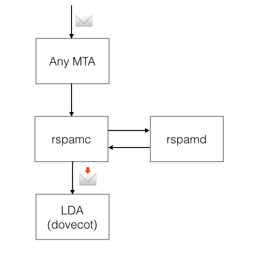

# Rspamd integration

This document describes several methods of integration rspamd to popular MTA. Among them are:

* [Postfix](http://www.postfix.org)
* [Exim](http://exim.org)
* [Sendmail](http://sendmail.org)
* [Haraka](https://haraka.github.io/)

Also this document describes rspamd LDA proxy mode that can be used for any MTA.

## Using rspamd with postfix MTA

For using rspamd in postfix it is recommended to use milter, namely `rmilter`. The interactions between postfix and rspamd are depicted in the following image:

Rmilter can be downloaded from github: <http://github.com/vstakhov/rmilter>.

### Configuring rmilter to work with rspamd

First of all build and install rmilter from the source (or use your OS packages if applicable):

	% ./configure
	% make
	# make install

Rmilter configuration is described in the [documentation](https://rspamd.com/rmilter/)
Here is an example of configuration for rspamd:


spamd {
        # use rspamd action for greylisting
        spamd_greylist = yes;
        
        # use rspamd action for messages
        spamd_soft_fail = yes;

        # add extended headers for messages
        extended_spam_headers = yes;

        # servers - spamd socket definitions in format:
        # /path/to/file
        # host[:port]
        # sockets are separated by ','
        # Default: empty
        servers = r:spam1.example.com:11333, r:spam2.example.com;

        # connect_timeout - timeout in miliseconds for connecting to rspamd
        # Default: 1s
        connect_timeout = 1s;

        # results_timeout - timeout in miliseconds for waiting for rspamd response
        # Default: 20s
        results_timeout = 60s;

        # error_time - time in seconds during which we are counting errors
        # Default: 10
        error_time = 10;

        # dead_time - time in seconds during which we are thinking that server is down
        # Default: 300
        dead_time = 300;

        # maxerrors - maximum number of errors that can occur during error_time to make us thinking that
        # this upstream is dead
        # Default: 10
        maxerrors = 10;

        # reject_message - reject message for spam
        reject_message = "Spam message rejected; If this is not spam contact abuse at example.com";

        # whitelist - list of ips or nets that should be not checked with spamd
        # Default: empty
        whitelist =
                10.0.0.0/8;
        
}


This configuration allows milter to use rspamd actions for messages (including greylisting). Default settings are just reject or not a message according to rspamd reply.

### Configuring postfix

Postfix configuration to use rspamd via rmilter is very simple:


smtpd_milters = unix:/var/run/rmilter/rmilter.sock
# or for TCP socket
# smtpd_milters = inet:localhost:9900
milter_protocol = 6
milter_mail_macros = i {mail_addr} {client_addr} {client_name} {auth_authen}
# skip mail without checks if milter will die
milter_default_action = accept


## Integration with exim MTA

Starting from Exim 4.86, you can use rspamd directly just like spamassassin:

Here is an example of exim configuration:


# Please mention the variant parameter
spamd_address = 127.0.0.1 11333 variant=rspamd

acl_smtp_data = acl_check_spam

acl_check_spam:
  # do not scan messages submitted from our own hosts
  accept hosts = +relay_from_hosts
  # do not scan messages from submission port
  accept condition = ${if eq {$interface_port}{587} {yes}{no}}
  # skip scanning for authenticated users
  accept authenticated = *
  warn  spam = nobody:true
  # add spam-score header
  warn  condition = ${if eq{$spam_action}{add header}}
        message = X-Spam-Score: $spam_score ($spam_bar)
  # add report header
  warn  condition = ${if eq{$spam_action}{add header}}
        message = X-Spam-Report: $spam_report
  # discard high-scoring mail
  deny  condition = ${if eq{$spam_action}{reject}}
        message = Message discarded as high-probability spam


## Using rspamd with sendmail MTA

Sendmail can use rspamd via rmilter as well as postfix.

And configure it just like for postfix. Sendmail configuration may be like this:

	INPUT_MAIL_FILTER(`rmilter', `S=unix:/var/run/rmilter/rmilter.sock, F=T')
	define(`confINPUT_MAIL_FILTERS', `rmilter')

Then compile m4 to cf in an ordinary way.

## Integration with Haraka MTA

A plugin implementing Rspamd integration for Haraka can be found in the [Haraka git repository](https://github.com/baudehlo/Haraka/); documentation can be found [here](https://github.com/baudehlo/Haraka/blob/master/docs/plugins/rspamd.md).

To install: copy `plugins/rspamd.js` to your local plugins directory and `config/rspamd.ini` to your local config directory; add `rspamd` to your `config/plugins` file in the `DATA` section and edit `config/rspamd.ini` to suit.

## LDA mode

In LDA mode, MTA calls rspamd client `rspamc` that scans a message on `rspamd` and appends scan results to the source message.
The overall scheme is demonstrated in the following picture:

To enable LDA mode, `rspamc` has the following options implemented:

- `--exec "/path/to/lda params"`: executes the binary specified to deliver modified message
- `--mime`: modify message instead of printing scan results only
- `--json`: optionally add the full ouptut as base64 encoded `JSON`

Here is an example of using `rspamc` + `dovecot` as LDA implemented using `fetchmail`:

    mda "/usr/bin/rspamc --mime --exec \"/usr/lib/dovecot/deliver -d %T\""

In this mode, `rspamc` cannot reject or greylist messages, but it appends the following headers that could be used for further filtering by means of LDA (for example, `sieve`):

- `X-Spam-Scanner`: name and version of rspamd
- `X-Spam`: has value `yes` if rspamd detects that a message as a spam (either `reject` or `add header` actions)
- `X-Spam-Action`: the desired action for a message (e.g. `no action`, `add header` or `reject`)
- `X-Spam-Result`: contains base64 encoded `JSON` reply from rspamd if `--json` option was given to `rspamc`

Please mention, that despite of the fact that this method can be used with any MTA (or even without MTA), it has more overhead than other methods and it cannot apply certain actions, namely, greylisting (however, that could also be implemented using external tools).
