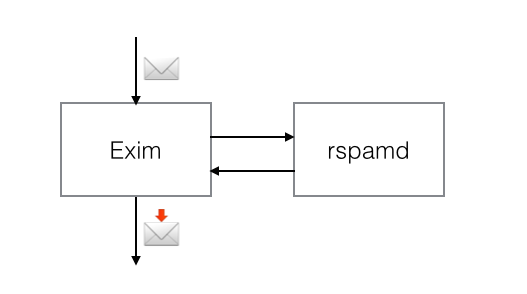

# MTA integration

This document describes several methods of integrating rspamd with some popular MTAs. Among them are:

* [Postfix](http://www.postfix.org)
* [Exim](http://exim.org)
* [Sendmail](http://sendmail.org)
* [Haraka](https://haraka.github.io/)
* [EmailSuccess](https://www.emailsuccess.com)

This document also describes the rspamd LDA proxy mode that can be used for any MTA.

## Using Rspamd with Postfix MTA

From version 1.6, you should use [rspamd proxy worker](./workers/rspamd_proxy.html) in Milter mode to integrate Rspamd in Postfix. 

### Configuring Postfix

Postfix configuration to scan messages on Rspamd daemon via milter protocol is very simple:

```sh
#smtpd_milters = unix:/var/lib/rspamd/milter.sock
# or for TCP socket
smtpd_milters = inet:localhost:11332

# skip mail without checks if something goes wrong
milter_default_action = accept

# 6 is the default milter protocol version;
# prior to Postfix 2.6 the default protocol was 2.
# milter_protocol = 6
```

## Integration with exim MTA

Starting from Exim 4.86, you can use Rspamd directly just like SpamAssassin:



For versions 4.70 through 4.84, a patch can be applied to enable integration. In the exim source directory run `patch -p1 < ../rspamd/contrib/exim/patch-exim-src_spam.c.diff`.

For version 4.85, run the following from `contrib/exim` in the rspamd source directory:
`patch patch-exim-src_spam.c.diff < patch-exim-src_spam.c.diff.exim-4.85.diff`
And then follow the steps above to apply the patch.

For versions 4.86 and 4.87 it is recommended to apply a patch to disable half-closed sockets:
`patch -p1 < ../rspamd/contrib/exim/shutdown.patch`

Alternatively, you can set `enable_shutdown_workaround = true` in `$LOCAL_CONFDIR/local.d/options.inc`

Here is an example of the Exim configuration:

```sh
# This is the global (top) section of the configuration file
# Please note the variant parameter in spamd_address setting
spamd_address = 127.0.0.1 11333 variant=rspamd

acl_smtp_data = acl_check_spam

begin acl

acl_check_spam:
  # do not scan messages submitted from our own hosts
  # +relay_from_hosts is assumed to be a list of hosts in configuration
  accept hosts = +relay_from_hosts

  # do not scan messages from submission port (or maybe you want to?)
  accept condition = ${if eq{$interface_port}{587}}

  # skip scanning for authenticated users (if desired?)
  accept authenticated = *

  # scan the message with rspamd
  warn spam = nobody:true
  # This will set variables as follows:
  # $spam_action is the action recommended by rspamd
  # $spam_score is the message score (we unlikely need it)
  # $spam_score_int is spam score multiplied by 10
  # $spam_report lists symbols matched & protocol messages
  # $spam_bar is a visual indicator of spam/ham level

  # use greylisting available in rspamd v1.3+
  defer message    = Please try again later
        condition  = ${if eq{$spam_action}{soft reject}}

  deny  message    = Message discarded as high-probability spam
        condition  = ${if eq{$spam_action}{reject}}

  # Remove foreign headers
  warn remove_header = x-spam-bar : x-spam-score : x-spam-report : x-spam-status

  # add spam-score and spam-report header when "add header" action is recommended by rspamd
  warn
    condition  = ${if eq{$spam_action}{add header}}
    add_header = X-Spam-Score: $spam_score ($spam_bar)
    add_header = X-Spam-Report: $spam_report

  # add x-spam-status header if message is not ham
  warn
    ! condition  = ${if match{$spam_action}{^no action\$|^greylist\$}}
    add_header = X-Spam-Status: Yes

  # add x-spam-bar header if score is positive
  warn
    condition = ${if >{$spam_score_int}{0}}
    add_header = X-Spam-Bar: $spam_bar

  accept
```

For further information please refer to the [Exim specification](http://www.exim.org/exim-html-current/doc/html/spec_html){:target="&#95;blank"}, especially the [chapter about content scanning](http://www.exim.org/exim-html-current/doc/html/spec_html/ch-content_scanning_at_acl_time.html){:target="&#95;blank"}.

## Using Rspamd with Sendmail MTA

Sendmail can use rspamd via milter and configuration is just like for postfix. sendmail configuration could be like:

	MAIL_FILTER(`rspamd', `S=inet:localhost:11332, F=T')
	define(`confINPUT_MAIL_FILTERS', `rspamd')

Then compile m4 to cf in the usual way.

## Integration with Haraka MTA

Support for rspamd is available in [Haraka v2.7.0+](http://haraka.github.io/manual/plugins/rspamd.html){:target="&#95;blank"}.

To enable: add `rspamd` to the `DATA` section of your `config/plugins` file and edit `config/rspamd.ini` to suit your preferences.

## Integration with EmailSuccess MTA

Support for rspamd is available from [EmailSuccess v11.19](https://www.emailsuccess.com/emailsuccess-introduces-rspamd-integration){:target="&#95;blank"}.

To enable: in the administration console, type `filter-module-set rspamd enabled true`. Edit filtering options with the `filter-module-show rspamd` and `filter-module-set rspamd` commands to suit your preferences.

You'll also need to enable the filter for each input interface (both SMTP and API) with `input-set INPUT1 filter enabled`, `ws-set rest_filter true` and `ws-set soap_filter true` commands.

For further information please refer directly to [EmailSuccess documentation](https://doc.emailsuccess.com){:target="&#95;blank"}.

## LDA mode

In LDA mode, the MTA calls the rspamd client `rspamc` which scans a message with `rspamd` and appends scan results to the source message. The overall scheme is demonstrated in the following picture:


To enable LDA mode, `rspamc` has the following options implemented:

- `--exec "/path/to/lda params"`: executes the binary specified to deliver modified message
- `--mime`: modify message instead of printing scan results only
- `--json`: optionally add the full output as base64 encoded `JSON`

Here is an example of using `rspamc` + `dovecot` as LDA implemented using `fetchmail`:

    mda "/usr/bin/rspamc --mime --exec \"/usr/lib/dovecot/deliver -d %T\""

In this mode, `rspamc` cannot reject or greylist messages, but it appends the following headers that can be used for further filtering by means of the LDA (for example, `sieve` or `procmail`):

- `X-Spam-Scanner`: name and version of rspamd
- `X-Spam`: has value `yes` if rspamd detects that a message as a spam (either `reject` or `add header` actions)
- `X-Spam-Action`: the desired action for a message (e.g. `no action`, `add header` or `reject`)
- `X-Spam-Result`: contains base64 encoded `JSON` reply from rspamd if `--json` option was given to `rspamc`

Please note that despite the fact that this method can be used with any MTA (or even without an MTA), it has more overhead than other methods and it cannot apply certain actions, like greylisting (however, that could also be implemented using external tools).
